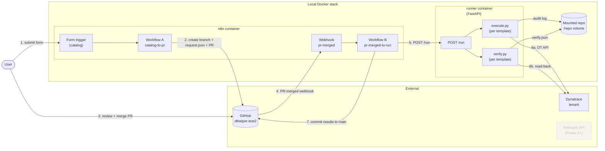
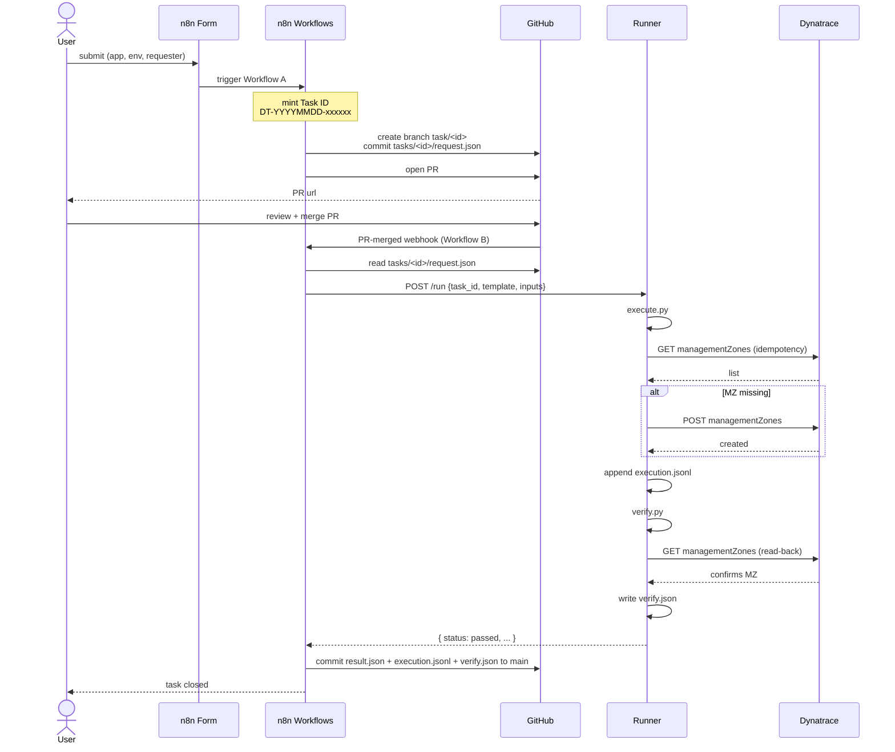

# Architecture — Phase 1

## Goal
Execute a Dynatrace administration task chosen from a catalog, with approval
via PR, and an auditable trail.

## Components

| Component | Role |
|---|---|
| n8n (Docker) | Catalog form, GitHub PR creation, webhook receiver, runner orchestration |
| Python runner (Docker, FastAPI) | Executes a template's `execute.py` + `verify.py` |
| GitHub | Source of truth for code, configs, templates, and task records |
| Dynatrace tenant | Target system |

## Component diagram

## Sequence — end-to-end task lifecycle

## Auditability (Rule 4, 17, 18)
Every step is one of:
- a commit (request, execution.jsonl, verify.json, result.json),
- a PR + review (the approval itself),
- a structured JSON line in `tasks/<id>/execution.jsonl`.

Task ID format: `DT-YYYYMMDD-<6 hex>`. Used as folder name, branch suffix,
and PR title prefix.

## Naming convention (Rule 11)
Defined in `config/naming-convention.yaml`. Example:
`myapp_uat_mz_default` = `{app}_{env}_{resource_type}_{name}`.

## Token-minimization (Rule 13)
- Phase 1 makes **zero LLM calls** at runtime. Catalog + templates are
  deterministic.
- When Phase 2 (CodeGen bot) lands, the bot will read `templates/index.yaml`
  and `docs/dt-api-index.md` only — no full repo load.

## Success criteria (Rule 4, 19)
1. Form submission produces a task ID like `DT-20260512-ab12cd`.
2. A PR appears in `dthelper-test2` containing only `tasks/<id>/request.json`.
3. Merging the PR triggers execution; an MZ named `myapp_uat_mz_default`
   exists in the DT tenant.
4. `tasks/<id>/verify.json` has `passed: true`.
5. Re-running with same inputs is idempotent (no duplicate MZ, verify still passes).
6. All artifacts (`request.json`, `execution.jsonl`, `verify.json`,
   `result.json`) are committed to `main` under `tasks/<id>/`.

## NOT in Phase 1
- LLM bots (Interface, CodeGen, Problem Responder) — see Phase 2+.
- Chat / Slack / Teams surface.
- Auto-retry on failure.
- Multiple apps / envs (only `myapp/uat` is configured).
